<h1 align="center">💫 About Project:</h1>

## 🧸 ClientSocialNetwork — Your Gateway to a Custom Social Network

ClientSocialNetwork is a sleek, modern client application for a social network, built with **React** and **TypeScript**. Designed for seamless interaction, it lets you connect with friends, share posts, and engage in real-time communication—all through an intuitive and responsive interface.

## 💻 Tech Stack:

  

- **This is the frontend repository the backend for this repository is located here - https://github.com/yowie645/express-api-social-network**

### ✨ Key Features

- **User Profiles:** View and edit your profile with ease.
- **News Feed:** Stay updated with the latest posts from your network.
- **Reactions & Comments:** Like posts and join discussions.
- **Avatar & Cover Updates:** Easily change your profile and cover images.
- **Followers & Subscriptions:** Track who follows you and manage your subscriptions.

### 🌈.ENV

- **VITE_API_URL**= VITE_API_URL

## 📸 Screenshots

### 🖼️ Interface

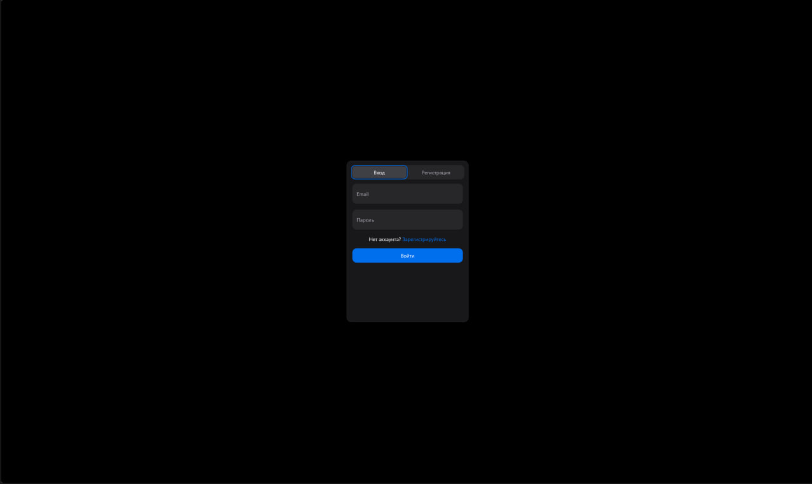
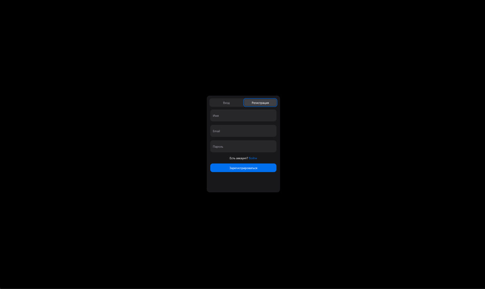
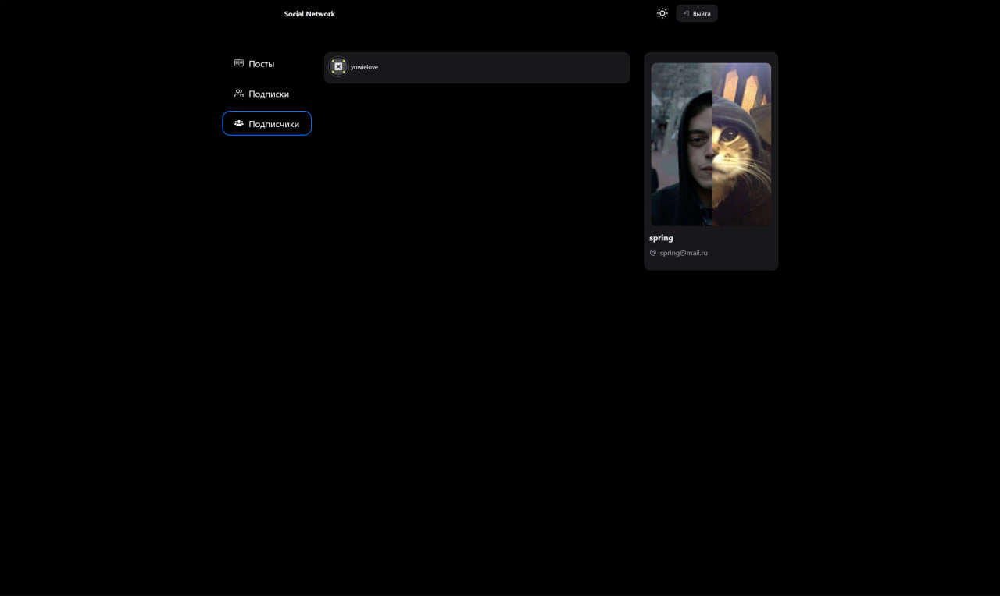
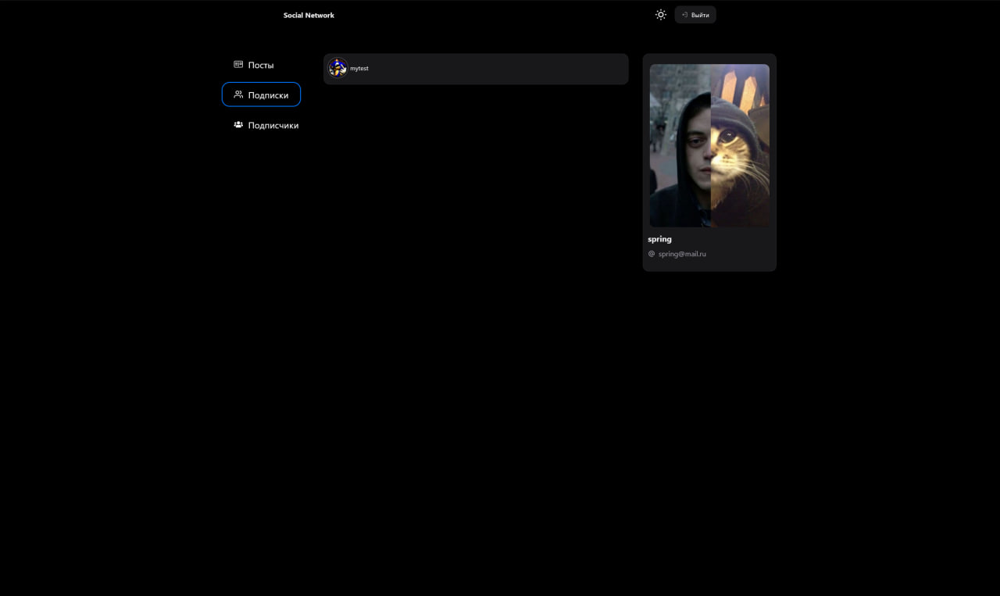
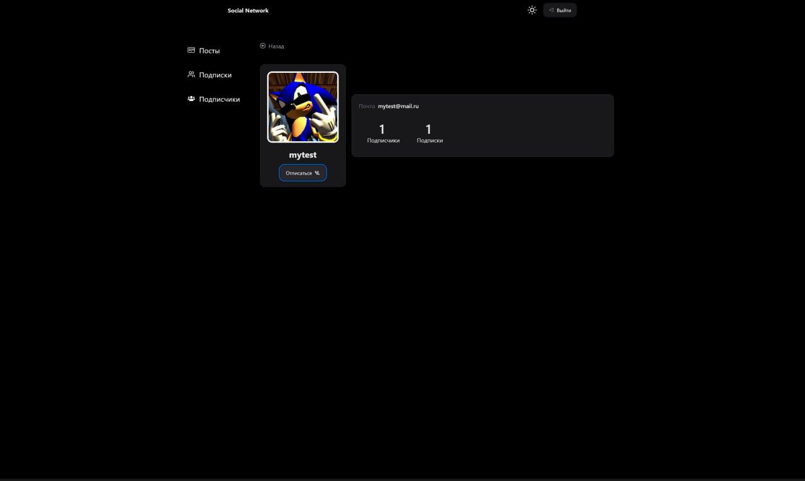
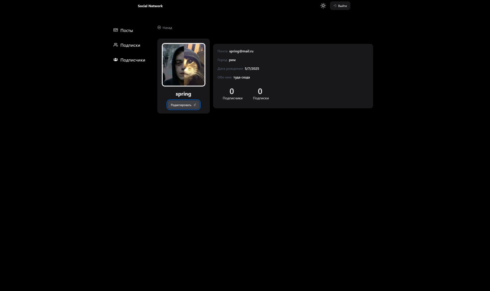
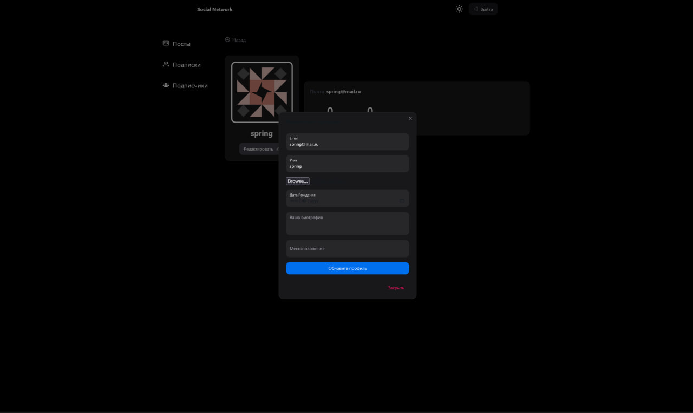
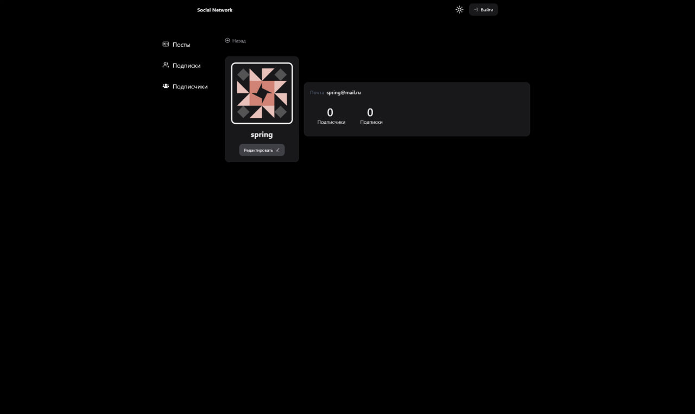
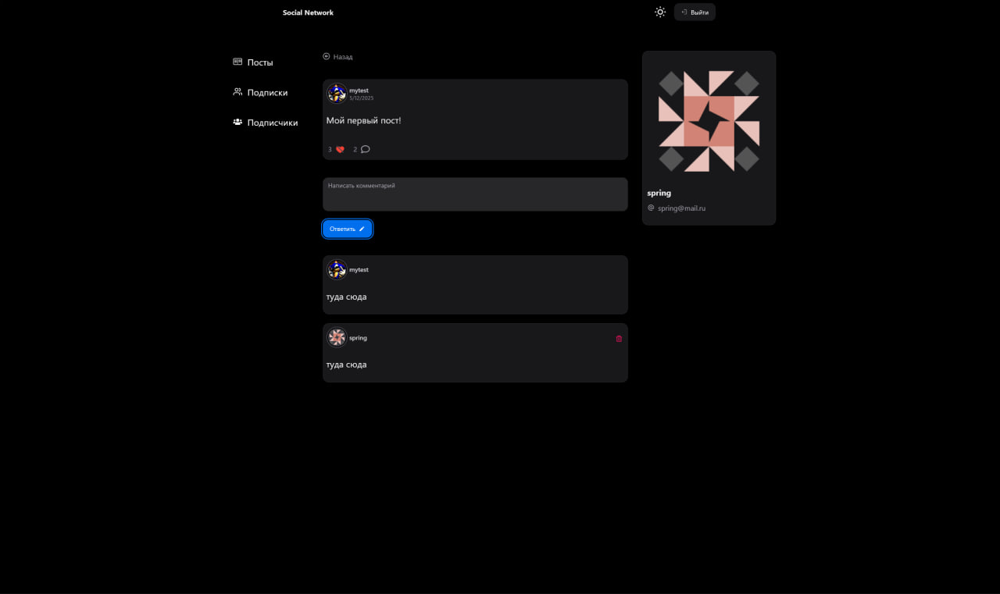
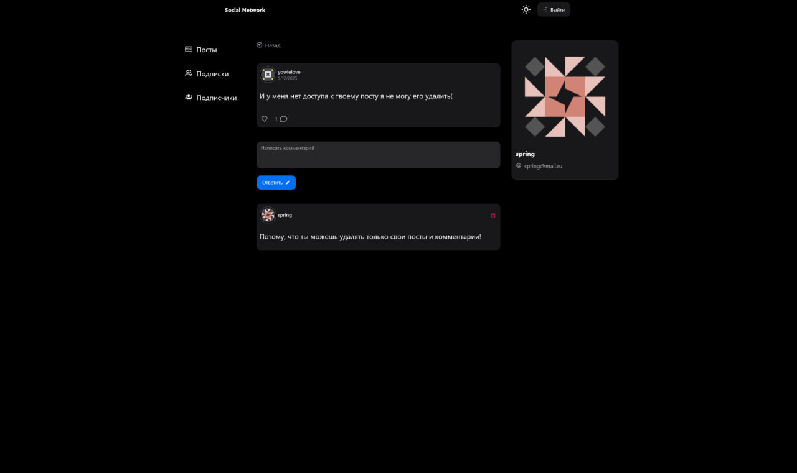
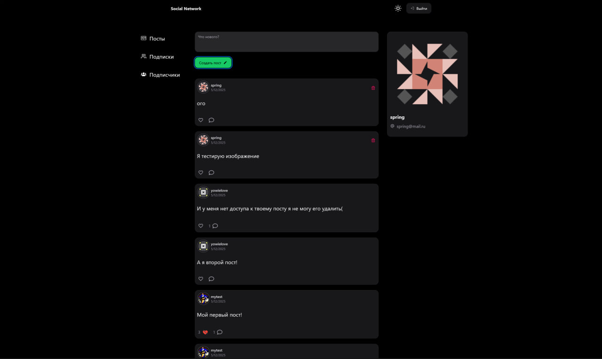

---

## 🛠️ Installation

### Prerequisites

- Uses [Vite](https://vitejs.dev/), [Vitest](https://vitest.dev/), and [React Testing Library](https://github.com/testing-library/react-testing-library) to create a modern [React](https://react.dev/) app compatible with [Create React App](https://create-react-app.dev/)
- Node.js

## 🪭 Quick Setup

### Clone repository

- git clone https://github.com/yowie645/client-social-network.git
- cd client-social-network

## Scripts

- `dev`/`start` - start dev server
- `build` - build for production
- `preview` - locally preview production build
- `test` - launch test runner

